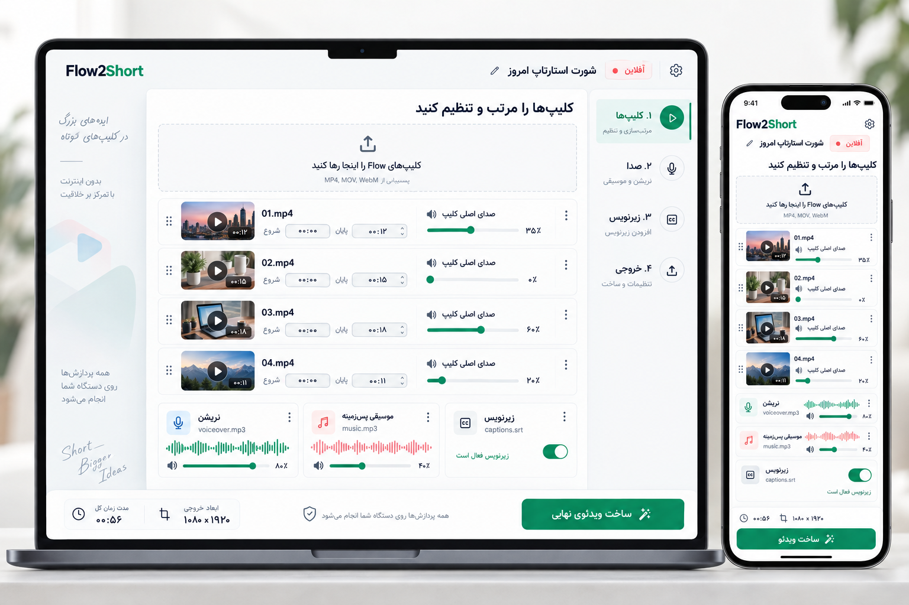

# Flow2Short Studio

یک وب‌اپ فارسی، آفلاین و متن‌باز برای تبدیل کلیپ‌های Google Flow به ویدئوی عمودی آماده انتشار؛ بدون نیاز به خط فرمان یا نرم‌افزار تدوین حرفه‌ای.

## نسخهٔ مخصوص مک‌بوک در دسترس است

نسخهٔ مستقل **Flow2Short Studio for macOS** برای مک‌های **Apple Silicon (M1 و جدیدتر)** با **macOS 13 یا جدیدتر** در شاخهٔ [`macos-native`](https://github.com/Grandudelife/Flow2Short/tree/macos-native) منتشر شده است. این نسخه پنجره و منوهای بومی مک و رندر محلی با FFmpeg بومی دارد و بدون مرورگر یا ترمینال اجرا می‌شود.

[دانلود بستهٔ آمادهٔ مک](https://github.com/Grandudelife/Flow2Short/releases/tag/macos-v1.0.0) · [راهنمای نصب و ساخت](https://github.com/Grandudelife/Flow2Short/blob/macos-native/macos/README.md)

## نسخهٔ مخصوص ویندوز در دسترس است

نسخهٔ مستقل **Flow2Short Studio for Windows** در شاخهٔ [`windows-native`](https://github.com/Grandudelife/Flow2Short/tree/windows-native) منتشر شده است. فایل EXE قابل حمل برای ویندوز ۱۱ و ویندوز ۱۰ نسخهٔ ۱۸۰۹ به بالا با پردازندهٔ Intel/AMD ۶۴بیتی، پنجره و منوهای بومی و رندر محلی با FFmpeg بومی دارد. .NET داخل فایل اجرایی قرار دارد و Microsoft Edge WebView2 Runtime باید نصب باشد. تصویر فعلی اپلیکیشن حفظ شده است.

[دانلود فایل EXE ویندوز](https://github.com/Grandudelife/Flow2Short/releases/tag/windows-v1.0.0) · [راهنمای نسخهٔ ویندوز](https://github.com/Grandudelife/Flow2Short/blob/windows-native/windows/README.md)



## امکانات

- ورود چند کلیپ MP4، MOV یا WebM
- مرتب‌سازی و پیش‌نمایش کلیپ‌ها
- تعیین نقطه شروع و پایان هر کلیپ
- تقسیم کلیپ در زمان دقیق فایل و ادغام بخش‌های مجاور، همراه تایم‌لاین قابل کلیک برای بررسی ترکیب
- انتخاب مستقل ترنزیشن بین هر دو کلیپ: محو نرم، زوم، حرکت به چپ، پاک‌شدن به راست و محو به سیاه با مدت‌های قابل تنظیم و دکمهٔ پیش‌نمایش همان گذار
- تنظیم مستقل صدای اصلی هر کلیپ از صفر تا صد درصد
- ساخت نریشن درون برنامه با Google Gemini 3.8 TTS، انتخاب نوع صدای زن/مرد/خنثی از کاتالوگ گوگل، لحن و سرعت؛ یا افزودن فایل صوتی خودتان
- پیش‌نمایش یکپارچه برش‌ها، صدای کلیپ، نریشن، موسیقی و زیرنویس پیش از خروجی
- ورود فایل زیرنویس SRT با ۶ استایل حرفه‌ای و تنظیم اندازه، رنگ و جایگاه
- اصلاح مستقل متن، زمان شروع و پایان هر زیرنویس، افزودن یا حذف ردیف، رفتن به همان لحظه و دانلود SRT اصلاح‌شده
- نمایش پانچ ۳ یا ۴ کلمه‌ای: هر کلمه با زمان‌بندی خودش به عبارت اضافه می‌شود؛ حالت تک‌کلمه‌ای هم موجود است
- جلو یا عقب بردن همهٔ زیرنویس‌ها بر حسب میلی‌ثانیه در پیش‌نمایش و خروجی
- افزودن لایه‌های زمان‌دار متن یا تصویر با تنظیم جایگاه و اندازه و نمایش در پیش‌نمایش و خروجی
- تنظیم گردی گوشه‌های هر تصویر از ۰ تا ۲۰٪ با پیش‌نمایش زنده و مقدار پیش‌فرض صفر، هم در پیش‌نمایش و هم در فایل خروجی
- تولید زیرنویس انگلیسی کلمه‌به‌کلمه از نریشن با زمان‌بندی مستقل هر کلمه از طریق Gemini API و دانلود دو نسخهٔ کلمه‌ای و استاندارد (اختیاری)
- ساخت کاور عمودی، افقی یا مربع از عکس یا فریم کلیپ با امکان کشیدن و بزرگ‌نمایی عکس، زیرعنوان، تنظیم خوانایی متن و لوگو؛ دانلود PNG جداگانه
- کم‌شدن خودکار موسیقی زیر نریشن، میزان قابل تنظیم و محوشدن نرم موسیقی در ابتدا و انتها
- نمایش اختیاری محدودهٔ امن تقریبی YouTube Shorts در پیش‌نمایش؛ جایگاه پیش‌فرض زیرنویس بالاتر از کنترل‌های پایین قرار می‌گیرد
- افزودن لوگوی PNG، JPG یا WebP به‌صورت واترمارک در ۹ جایگاه با اندازهٔ قابل تنظیم و پیش‌نمایش زنده
- مرحلهٔ مستقل واترمارک در منوی سمت راست و امکان افزودن لوگو و تغییر جایگاه از پنجرهٔ پیش‌نمایش ترکیب
- تغییر پانچ و سینک در خود پنجرهٔ پیش‌نمایش، نمایش زمان SRT با دقت میلی‌ثانیه و پرش به اولین کلمه
- تثبیت استایل انتخاب‌شده زیرنویس روی ویدئوی خروجی
- ذخیره و بازکردن Recipe پروژه
- خروجی محلی MP4 با ابعاد 1080×1920 یا 720×1280
- رابط فارسی RTL با فونت Vazirmatn
- PWA قابل نصب و استفاده آفلاین پس از نخستین بارگذاری

## ترنزیشن‌ها

در کارت هر کلیپ (به‌جز آخرین کلیپ)، ترنزیشن به کلیپ بعدی و مدت ۰٫۳، ۰٫۴ یا ۰٫۶ ثانیه را انتخاب کنید. «دیدن گذار» پیش‌نمایش ترکیب را نزدیک همان مرز باز می‌کند. افکت‌ها از دسته‌های محبوب ترنزیشن در CapCut الهام گرفته‌اند و در خروجی MP4 هم اعمال می‌شوند. طول کل ویدئو، زمان نریشن و زمان زیرنویس با انتخاب ترنزیشن تغییر نمی‌کند: فریم انتهایی کلیپ قبلی هنگام ورود کلیپ جدید نمایش داده می‌شود. تنظیمات هر کلیپ در Recipe ذخیره می‌شود؛ خود فایل‌های ویدئویی را هنگام بازکردن پروژه دوباره انتخاب کنید.

## ویرایش دقیق در نسخهٔ ۱.۸

در کارت کلیپ، زمان تقسیم را برحسب ثانیهٔ فایل اصلی وارد کنید. هر بخش تازه می‌تواند حجم صدا، برش و ترنزیشن خودش را داشته باشد. تایم‌لاین زیر کارت‌ها برای پرش به ابتدای هر بخش است. برای اصلاح SRT، بخش «ویرایش دقیق متن و زمان زیرنویس» را باز کنید؛ زمان‌ها برحسب ثانیهٔ ویدئوی نهایی هستند. دکمهٔ دانلود SRT اصلاح‌شده، جابه‌جایی کلی زیرنویس را هم داخل فایل دانلودی اعمال می‌کند. متن، عکس و تنظیمات صوتی در Recipe ذخیره می‌شوند؛ پس از بازکردن پروژه، فایل‌های رسانه‌ای و تصاویر را دوباره متصل کنید. راهنمای محدودهٔ امن در پیش‌نمایش فقط یک تقریب است و روی ویدئوی خروجی ثبت نمی‌شود. در مک یا ویندوز، برای رندر فایل‌های طولانی‌تر استفاده از نسخهٔ ۷۲۰p مناسب‌تر است.

اگر تثبیت زیرنویس فعال باشد و موتور ویدئو نتواند آن را روی خروجی ثبت کند، خطا نمایش داده می‌شود تا فایل بدون زیرنویس به‌اشتباه دانلود نشود. برش‌ها در خروجی با نرخ ۳۰ فریم‌برثانیه ساخته می‌شوند؛ تنظیمات زمانی ریزتر از یک فریم ممکن است به نزدیک‌ترین فریم گرد شوند.

## رفع مشکل پیش‌نمایش در نسخهٔ ۱.۹

پخش پیش‌نمایش هنگام نمایش صفحهٔ قدیمی با کد نسخهٔ جدید قطع می‌شد. اکنون برنامه نسخهٔ صفحه را بررسی و در صورت نیاز آن را تازه می‌کند؛ پیش‌نمایش نیز نبودن اجزای نسخهٔ قدیمی را تحمل می‌کند. در اجرای محلی، کش برنامهٔ قدیمی پاک می‌شود و لانچر اگر درگاه پیش‌فرض مشغول باشد یک درگاه آزاد دیگر انتخاب می‌کند. برای اجرای نسخهٔ تازه فایل لانچر همین بسته را باز کنید؛ اگر زبانهٔ قبلی باز مانده است، از زبانه‌ای استفاده کنید که لانچر جدید باز می‌کند.

## قابلیت‌های نسخهٔ ۲.۰

در نسخهٔ ۲.۰ رونویسی کلمه‌ای با مدل `gemini-3.5-transcribe`، کاور ویدئو و گردی گوشهٔ عکس افزوده شد.

## قابلیت‌های نسخهٔ ۲.۱: استودیوی گفتار و دو خروجی زیرنویس

در **تنظیمات برنامه** کلید Gemini API را یک‌بار وارد و ذخیره کنید. این کلید فقط در پوشهٔ تنظیمات کاربر همین دستگاه با دسترسی محدود نگهداری می‌شود؛ در فایل پروژه، مرورگر و بستهٔ نصب ذخیره نمی‌شود. در بخش **صدا** متن انگلیسی را وارد کنید، نوع صدا و سپس گوینده‌ای از فهرست به‌روز Google را انتخاب کنید. مدل کیفیت استودیویی (`gemini-3.8-flash-tts`) یا گزینهٔ سریع‌تر، لحن و سرعت خوانش را تنظیم و «ساخت نریشن» را بزنید. خروجی WAV هم پخش و دانلود می‌شود، هم خودکار نریشن پروژه خواهد شد. سرعت و لحن دستورهای خوانش مدل‌اند و مقدار عددی قطعی برای سرعت نیستند.

اگر «پس از ساخت صدا، زیرنویس…» روشن باشد، صدای ساخته‌شده در یک درخواست جداگانه به `gemini-3.5-transcribe` داده می‌شود تا زمان هر کلمه از *صدای واقعی* گرفته شود. در بخش **زیرنویس** می‌توانید برای نریشن واردشده یا فایل مستقل هم همین کار را انجام دهید. زیرنویس پیشین در صورت خطا حفظ می‌شود؛ جابه‌جایی کلی پس از تولید روی صفر می‌رود. دکمه‌های ویرایشگر دو فایل SRT می‌دهند: **کلمه‌ای** با زمان مستقل هر واژه و **استاندارد** با جمله‌ها و مکث‌های طبیعی، حداکثر ۹ واژه یا ۴ ثانیه در هر قطعه. گزینهٔ «استاندارد» در انتخاب نمایش کلمات، پیش‌نمایش و فایل MP4 را نیز جمله‌ای می‌کند. زمان‌ها و متن واژه‌ها را پیش از خروجی بررسی و اصلاح کنید.

### اصلاح نسخهٔ ۲.۱.۱

نسخهٔ ۲.۱ کلیدهای جدید Google AI Studio از نوع Auth را که نقطه (`AQ.`) دارند اشتباهاً رد می‌کرد. در نسخهٔ ۲.۱.۱ این فرمت نیز پذیرفته می‌شود. برای ثبت کلید فقط خود مقدار کلید را در تنظیمات وارد کنید؛ مقدار آن را در گفتگو یا فایل پروژه قرار ندهید.

کلید و فایل صوتی فقط با اقدام شما برای پردازش به Google فرستاده می‌شوند؛ فایل آپلودشدهٔ رونویسی پس از پردازش از Files API حذف می‌شود. **اشتراک Google Pro اعتبار Gemini API محسوب نمی‌شود** و هر درخواست صدا یا رونویسی ممکن است هزینه داشته باشد. امکانات Google به اینترنت و اجرای محلی با لانچر Python یا لانچر مستقل Go نیاز دارند. هنگام بازکردن مستقیم فایل یا استفاده از هاست استاتیک، همچنان می‌توانید صدا و SRT خود را دستی وارد کنید.

در بخش «کاور ویدئو»، عکس PNG/JPG/WebP بدهید یا از کلیپ یک فریم انتخاب کنید. عنوان، اندازه/رنگ/جای متن، تیرگی تصویر و لوگوی واترمارک یا لوگوی جداگانه را تنظیم و PNG عمودی دانلود کنید. تنظیمات در Recipe ذخیره می‌شوند؛ فایل عکس و لوگوی جداگانه و فریم پس از بازکردن پروژه باید دوباره انتخاب شوند. تصویر کاور جدا از MP4 ساخته می‌شود و باید در YouTube Studio به‌عنوان Thumbnail ویدئو بارگذاری شود.

در بخش «متن و تصویر روی ویدئو» برای تصویر هنگام افزودن یا بعداً در کارت همان لایه، گردی گوشه را تنظیم کنید؛ مقدار روی فایل خروجی نیز اعمال می‌شود.

## حریم خصوصی

ساخت ویدئو، کاور و پردازش لایه‌ها روی دستگاه انجام می‌شود. فقط با درخواست شما، متن نریشن برای گفتارسازی و فایل صوتی انتخاب‌شده برای زیرنویس به Gemini API فرستاده می‌شوند؛ کلید API در فایل پروژه ذخیره نمی‌شود و از تنظیمات برنامه قابل حذف است.

## زیرنویس کلمه‌به‌کلمه

برای نمایش پانچ، فایل SRT باید هر کلمه را در یک بازهٔ زمانی جداگانه داشته باشد؛ برنامه آن را به‌صورت خودکار تشخیص می‌دهد. پیش‌فرض ۳ کلمه در هر عبارت است. کلمات یکی‌یکی به عبارت اضافه می‌شوند و بعد از ۳ یا ۴ کلمه، نشانهٔ پایان جمله یا مکث بیش از ۵۵۰ میلی‌ثانیه، عبارت تازه آغاز می‌شود. می‌توانید حالت تک‌کلمه‌ای را هم انتخاب کنید. در بخش «هماهنگی زیرنویس با صدا»، عدد منفی کلمات را زودتر و عدد مثبت دیرتر نمایش می‌دهد. دقت زمانی زیرنویس خروجی ۱۰ میلی‌ثانیه است. تنظیم نمایش و جابه‌جایی با Recipe پروژه ذخیره می‌شود، اما خود فایل SRT پس از بازکردن Recipe باید دوباره انتخاب شود.

برای مقایسه، هنگام پخش ویدئو گزینهٔ پانچ یا مقدار سینک را در همان پنجرهٔ «پیش‌نمایش ترکیب نهایی» تغییر دهید. سطر «زمان ویدئو / زمان SRT» تأثیر جابه‌جایی را نشان می‌دهد؛ اگر در میانهٔ یک کلمه هستید، جابه‌جایی کوچک ممکن است متن فعلی را عوض نکند، اما مرز ورود کلمه را تغییر می‌دهد. دکمهٔ «رفتن به اولین کلمه» برای رسیدن به زمان مناسب تست است.

## اجرای نسخه آماده

### مک و ویندوز

فایل `index.html` را مستقیم باز نکنید؛ مرورگر اجرای موتور ویدئو را روی آدرس‌های `file://` محدود می‌کند.

- در مک روی `Start Flow2Short.command` دوبار کلیک کنید. اگر macOS بار اول آن را مسدود کرد، روی فایل راست‌کلیک و **Open** را انتخاب کنید.
- در ویندوز روی `Start Flow2Short Windows.bat` دوبار کلیک کنید.

لانچر یک سرور محلی فقط روی `127.0.0.1` ایجاد و برنامه را در مرورگر باز می‌کند. اگر نسخهٔ دیگری هنوز باز باشد، درگاه بعدیِ آزاد را انتخاب می‌کند. پنجره لانچر را تا پایان کار باز نگه دارید. لانچر مک ابتدا Python 3 و سپس Ruby داخلی سیستم را امتحان می‌کند؛ لانچر ویندوز به Python 3 نیاز دارد. بسته‌های Release ساخته‌شده در GitHub لانچر مستقل و بدون این وابستگی دارند.

اگر در نوار آدرس Chrome واژه **File** دیده می‌شود، برنامه هنوز مستقیم باز شده و ساخت خروجی عمداً غیرفعال است. آدرس صحیح اجرای محلی با `http://127.0.0.1:43121` شروع می‌شود. پیش‌نمایش ترکیبی حتی در حالت File قابل استفاده است.

### آیفون و آیپد

نسخه GitHub Pages را در Safari باز کنید و از Share → Add to Home Screen برنامه را نصب کنید. پس از بارگذاری کامل موتور ویدئو، برنامه آفلاین هم باز می‌شود. پروژه‌های سنگین 1080p ممکن است از حافظه آیفون بیشتر باشند؛ در این حالت Recipe پروژه را ذخیره و خروجی را روی دسکتاپ بسازید.

## اجرای توسعه

هر وب‌سرور استاتیک می‌تواند پوشه `app/` را سرو کند. بازکردن مستقیم `index.html` اکنون برای بررسی رابط و کنترل‌ها کار می‌کند، اما Web Worker مرورگر اجازه ساخت ویدئوی نهایی از پروتکل `file://` را نمی‌دهد؛ برای خروجی از لانچر استفاده کنید.

لانچر محلی با Go نوشته شده است:

```bash
go run ./server
```

## انتشار روی GitHub Pages

Workflow آماده در `.github/workflows/pages.yml` پوشه `app/` را منتشر می‌کند. پس از Push:

1. در Repository به Settings → Pages بروید.
2. Source را روی `GitHub Actions` قرار دهید.
3. Workflow `Deploy Flow2Short to GitHub Pages` را اجرا کنید.

## ساختار پروژه

```text
app/       رابط، PWA و موتور FFmpeg WebAssembly
server/    لانچر محلی مک و ویندوز
design/    مرجع بصری تأییدشده
Start Flow2Short.command       اجرای دوبارکلیکی روی مک
Start Flow2Short Windows.bat   اجرای دوبارکلیکی روی ویندوز
```

## نکات فنی

- پردازش ویدئو با FFmpeg WebAssembly انجام می‌شود و از FFmpeg بومی کندتر است.
- در صورت پشتیبانی‌نکردن build مرورگر از فیلتر زیرنویس، ویدئو بدون زیرنویس تصویری ساخته می‌شود و فایل SRT اصلی دست‌نخورده باقی می‌ماند.
- Recipe پروژه فقط تنظیمات و نام فایل‌ها را ذخیره می‌کند؛ رسانه‌ها برای حفظ حریم خصوصی داخل JSON کپی نمی‌شوند.

## مجوز و وابستگی‌ها

برای کد اختصاصی پروژه هنوز مجوزی انتخاب نشده است. وابستگی‌های بسته‌شده مجوزهای مستقل دارند؛ جزئیات در `THIRD_PARTY_NOTICES.md` آمده است. قبل از عمومی‌کردن Repository، مجوز نهایی پروژه را آگاهانه انتخاب کنید.

## نسخهٔ ۲.۲: گفتار، زیرنویس و کاور

در مرحلهٔ صدا، «تبدیل متن به گفتار» کنار «ساخت زیرنویس از صدا» قرار دارد. برای زیرنویس بدون نریشن، فایل صوتی را در همان کارت انتخاب کنید؛ منبع خودکار روی «فایل صوتی جداگانه» می‌رود. پس از تولید گفتار، WAV و پس از رونویسی، SRT کلمه‌ای و استاندارد از همان قسمت دانلود می‌شوند. برای زمان‌بندی دقیق، پیش‌نمایش و ویرایشگر زیرنویس را بررسی کنید.

کاور را در سه نسبت ۹:۱۶، ۱۶:۹ و ۱:۱ می‌سازید؛ عکس را روی بوم بکشید، بزرگ‌نمایی یا نمایش کامل را انتخاب کنید و زیرعنوان، چینش و زمینهٔ عنوان را تنظیم کنید. بوم پیش‌نمایش همان منبع PNG خروجی است. تصاویر روی ویدئو به‌طور پیش‌فرض گوشهٔ صاف دارند؛ گردی را از صفر تا ۲۰٪ با پیش‌نمایش کنار فرم تنظیم کنید و سپس لایه را در پیش‌نمایش ویدئو ببینید.

## نسخهٔ ۲.۳: گوینده، جای‌گذاری و کاور

انتخاب گوینده اکنون با جست‌وجو و کارت‌های کوتاه انجام می‌شود. دکمهٔ «نمونه» یک متن کوتاه را با همان گوینده از Google می‌سازد؛ پس از نخستین پخش، نمونه در حافظهٔ نشست نگه داشته می‌شود. ساخت نمونه می‌تواند از سهمیهٔ API شما استفاده کند.

صدا بلافاصله پس از ساخت برای پخش و دانلود در دسترس است و رونویسی دقیق در پس‌زمینه ادامه می‌یابد. زیرنویس کلمه‌ای و استاندارد از زمان واقعی صدای تولیدشده به دست می‌آیند. فرستادن متن به‌صورت هم‌زمان با درخواست ساخت صدا زمان دقیق هر واژه را نمی‌دهد؛ بنابراین SRT تقریبی تولید نمی‌کنیم. پس از پاسخ رونویسی، هر دو خروجی SRT فعال می‌شوند.

متن و تصویر زمان‌دار را پس از افزودن در پیش‌نمایش ویدئو بکشید، یا محل افقی و عمودی را با کنترل‌های مجزا تعیین کنید. مختصات در Recipe و فایل خروجی ذخیره می‌شود. در کاور می‌توانید «جابه‌جایی لوگو» را انتخاب کرده و لوگو را روی بوم بکشید؛ اندازه و گردی گوشه‌های لوگو نیز روی همان PNG خروجی نمایش داده می‌شوند.
